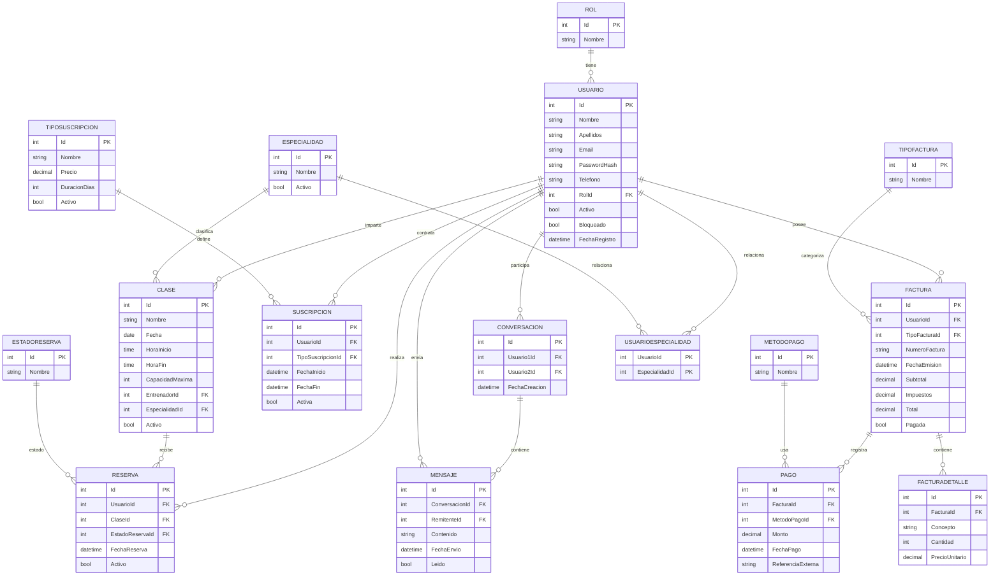

# Base de datos FitControl Web

## Diagrama entidad-relación

## Tablas principales

- **Usuario**: almacena los datos de acceso, perfil, rol, estado de cuenta, bloqueos y tokens de recuperación.
- **Rol**: define los perfiles del sistema, principalmente administrador, entrenador y cliente.
- **Clase**: representa cada sesión deportiva, indicando entrenador, especialidad, horario, capacidad y estado.
- **Reserva**: registra la inscripción de un cliente en una clase concreta.
- **EstadoReserva**: normaliza el estado funcional de cada reserva, como activa, cancelada o equivalente.
- **Suscripcion**: guarda la contratación de un plan por parte del cliente con su rango de fechas.
- **TipoSuscripcion**: define el catálogo de planes disponibles, precio, duración y activación.
- **Factura**: recoge la cabecera económica del documento emitido al usuario.
- **FacturaDetalle**: desglosa conceptos, cantidades y precio unitario de cada factura.
- **Pago**: registra los pagos asociados a una factura, incluyendo método e identificador externo.
- **MetodoPago**: catálogo de medios de pago admitidos, por ejemplo Stripe o pago manual.
- **Conversacion**: representa un canal de comunicación privado entre dos usuarios.
- **Mensaje**: contiene cada texto enviado dentro de una conversación, junto con fecha y estado de lectura.

## Nota técnica

Además de las tablas anteriores, el proyecto incorpora tablas auxiliares como `TipoFactura`, `UsuarioEspecialidad`, `UsuarioLoginLog` y `Auditoria`, que refuerzan la trazabilidad, la gestión interna y la organización funcional del sistema.
