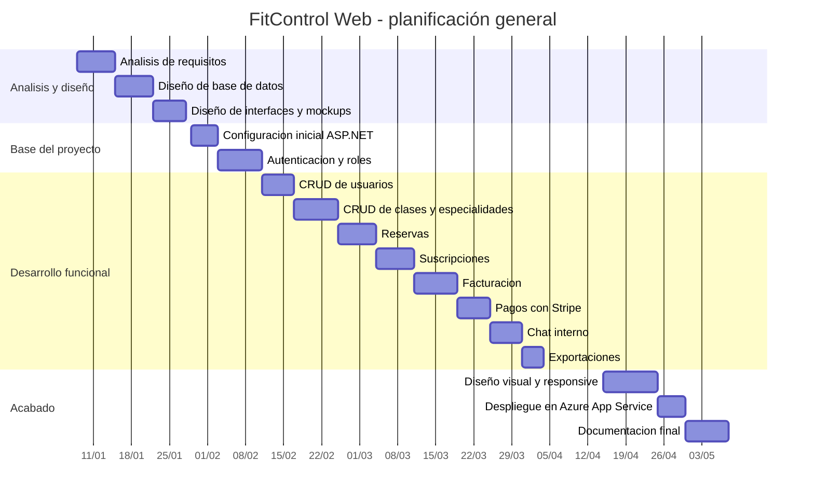

# Planificación del proyecto

```mermaid
gantt
    title FitControl Web - planificación general
    dateFormat  YYYY-MM-DD
    axisFormat  %d/%m

    section Analisis y diseño
    Analisis de requisitos            :a1, 2026-01-08, 7d
    Diseño de base de datos           :a2, after a1, 7d
    Diseño de interfaces y mockups    :a3, after a2, 6d

    section Base del proyecto
    Configuracion inicial ASP.NET     :b1, 2026-01-29, 5d
    Autenticacion y roles             :b2, after b1, 8d

    section Desarrollo funcional
    CRUD de usuarios                  :c1, 2026-02-11, 6d
    CRUD de clases y especialidades   :c2, after c1, 8d
    Reservas                          :c3, after c2, 7d
    Suscripciones                     :c4, after c3, 7d
    Facturacion                       :c5, after c4, 8d
    Pagos con Stripe                  :c6, after c5, 6d
    Chat interno                      :c7, after c6, 6d
    Exportaciones                     :c8, after c7, 4d

    section Acabado
    Diseño visual y responsive        :d1, 2026-04-15, 10d
    Despliegue en Azure App Service   :d2, after d1, 5d
    Documentacion final               :d3, after d2, 8d
```
