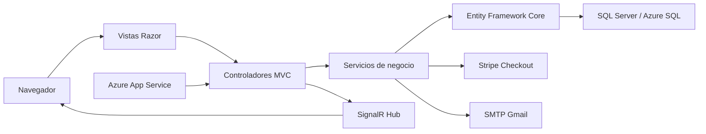

# Memoria Final de Proyecto

## Titulo del Proyecto

**FitControl Web**

## Autor

Marek Krupoves

## Ciclo Formativo

Ciclo Formativo de Grado Superior en Desarrollo de Aplicaciones Web.

## Tutores

Manuel Perez Alfonso  
Jose Juan Lopez Velez

## Introduccion

FitControl Web es una aplicacion web destinada a la gestion integral de un gimnasio. El sistema centraliza la administracion de usuarios, entrenadores, clases, reservas, suscripciones, facturas, pagos y comunicacion interna. La plataforma se basa en un modelo de roles, diferenciando claramente entre administrador, entrenador y cliente.

El objetivo principal del proyecto es construir una aplicacion funcional, realista y defendible dentro del modulo de Proyecto de DAW, aplicando conocimientos de backend, frontend, bases de datos, autenticacion, seguridad, despliegue y experiencia de usuario.

La aplicacion ha sido desarrollada con ASP.NET Core MVC, Entity Framework Core y SQL Server, incorporando integraciones externas como Stripe para pagos, SMTP para envio de correos y SignalR para mensajeria en tiempo real.

## Introduction in English

FitControl Web is a web application designed for the integral management of a gym. The system centralizes user administration, trainers, classes, bookings, subscriptions, invoices, payments and internal communication. The platform is based on a role-based model, clearly separating administrator, trainer and client permissions.

The main objective of the project is to build a functional, realistic and defendable application for the Web Application Development final project module, applying knowledge related to backend development, frontend design, databases, authentication, security, deployment and user experience.

The application has been developed with ASP.NET Core MVC, Entity Framework Core and SQL Server, including external integrations such as Stripe for payments, SMTP for email delivery and SignalR for real-time messaging.

## Objetivos

El objetivo general es desarrollar una aplicacion web completa para la gestion de un gimnasio, simulando un entorno real donde distintos perfiles puedan interactuar con el sistema de forma segura y organizada.

### Objetivos de la fase actual

- Implementar autenticacion con roles: administrador, entrenador y cliente.
- Gestionar usuarios, entrenadores, especialidades y metodos de pago.
- Crear, editar y dar de baja clases con validacion de horarios, aforo y entrenador.
- Permitir que los clientes reserven clases disponibles con control de plazas y solapes horarios.
- Gestionar suscripciones y evitar que un cliente tenga mas de una suscripcion activa o pendiente de pago.
- Generar facturas asociadas a suscripciones.
- Integrar pago real en modo test mediante Stripe.
- Confirmar pagos y activar suscripciones automaticamente.
- Enviar correos de bienvenida, bloqueo/recuperacion de cuenta y pago confirmado con factura adjunta.
- Implementar chat interno mediante SignalR.
- Crear dashboards para administrador, entrenador y cliente.
- Incorporar exportaciones a CSV, Excel y PDF en listados administrativos.
- Mejorar el diseno visual, la usabilidad y la adaptacion responsive.

### Objetivos para fases futuras

- Migrar la confirmacion principal de Stripe a webhooks en produccion con configuracion completa desde el panel de Stripe.
- Incorporar auditoria completa de acciones administrativas.
- Gestionar devoluciones y cancelaciones economicas de forma mas avanzada.
- Crear un modulo de notificaciones persistentes en base de datos.
- Incluir estadisticas avanzadas de asistencia, ocupacion y facturacion.
- Incorporar tests automaticos unitarios y de integracion.
- Mejorar el sistema documental de facturas con almacenamiento privado y versionado.

## Planificacion

### Tabla de hitos

| Fase | Tareas principales | Duracion estimada |
| --- | --- | --- |
| Analisis | Definicion del problema, roles y funcionalidades | 2 dias |
| Diseno de base de datos | Entidades, relaciones y reglas de negocio | 3 dias |
| Configuracion inicial | Proyecto ASP.NET Core MVC, EF Core y SQL Server | 2 dias |
| Autenticacion | Login, registro, roles, bloqueo y recuperacion | 4 dias |
| CRUD administrativo | Usuarios, clases, especialidades, metodos y tipos de suscripcion | 7 dias |
| Reservas | Reserva de clases, aforo, solapes y cancelaciones | 4 dias |
| Suscripciones | Contratacion, estados, restricciones y facturacion | 4 dias |
| Facturacion y pagos | Facturas PDF, Stripe test y confirmacion de pago | 5 dias |
| Chat | Conversaciones, mensajes y SignalR | 4 dias |
| Diseno visual | Responsive, tema, iconos y mejoras UI | 5 dias |
| Exportaciones | CSV, Excel y PDF | 3 dias |
| Despliegue | Configuracion de entorno, appsettings y Azure App Service | 2 dias |
| Documentacion | Memoria, diagramas, capturas y presentacion | 3 dias |

### Diagrama de Gantt

El diagrama de Gantt se encuentra en `docs/gantt.md`.

## Analisis

### Estado del arte

Existen soluciones comerciales como Virtuagym, Glofox, Mindbody o aplicaciones de gestion de centros deportivos que permiten controlar socios, clases, pagos y reservas. Estas plataformas suelen ser muy completas, pero tambien complejas y orientadas a explotacion comercial.

FitControl Web se diferencia en que esta planteada como una solucion academica, clara y mantenible, centrada en demostrar arquitectura MVC, separacion por servicios, gestion de roles, persistencia con Entity Framework Core, integraciones reales y una experiencia visual cuidada.

### Funcionalidades

El administrador puede gestionar usuarios, clases, entrenadores, especialidades, suscripciones, facturas, pagos, exportaciones y dashboards. Tambien puede enviar correos directos a usuarios.

El entrenador puede consultar sus clases, ver reservas asociadas, acceder a su dashboard, modificar su perfil y comunicarse con clientes o con otros entrenadores mediante mensajeria interna.

El cliente puede gestionar su perfil, contratar una suscripcion, pagar facturas, reservar clases disponibles, consultar sus reservas, descargar facturas y comunicarse con entrenadores.

## Diseno

### Requisitos tecnicos

- Aplicacion web basada en ASP.NET Core MVC.
- Persistencia mediante SQL Server y Entity Framework Core.
- Separacion de responsabilidades mediante controladores, servicios, modelos y vistas.
- Autenticacion mediante cookies y autorizacion por roles.
- Envio de correos mediante SMTP.
- Pago mediante Stripe Checkout en modo test.
- Mensajeria en tiempo real con SignalR.
- Generacion de documentos PDF y exportacion de datos.
- Interfaz responsive con Bootstrap, CSS propio e iconos Bootstrap Icons.

### Arquitectura web

La aplicacion sigue el patron MVC. Las peticiones llegan a los controladores, que validan permisos y delegan la logica en servicios. Los servicios aplican reglas de negocio y trabajan con Entity Framework Core para acceder a SQL Server. Las vistas Razor muestran la informacion al usuario y utilizan componentes comunes para alertas, exportaciones y layout.

La arquitectura puede resumirse asi:

### Diseno back-end

El backend esta implementado en C# con ASP.NET Core MVC. Se han creado servicios para encapsular la logica principal:

- `AuthService`: login, bloqueo, recuperacion de contrasena y sesion.
- `UsuarioService`: gestion de usuarios, roles, baja logica y fotografia.
- `ClaseService`: clases, horarios, aforo, filtros y calendario.
- `ReservaService`: reservas, cancelaciones, plazas y solapes.
- `SuscripcionService`: contratacion, estados y reglas de suscripcion.
- `FacturaService`: facturas, PDFs, Stripe y confirmacion de pago.
- `ChatService`: conversaciones, mensajes y permisos de comunicacion.
- `EmailService` y `EmailTemplateService`: envio y plantillas profesionales.

### Modelo de datos

Las entidades principales son Usuario, Rol, Clase, Reserva, EstadoReserva, Suscripcion, TipoSuscripcion, Factura, FacturaDetalle, Pago, MetodoPago, Conversacion y Mensaje. El diagrama ER se encuentra en `docs/diagramas/base-datos.md`.

### Servicios REST

La aplicacion no es una API REST pura. Se ha construido como aplicacion MVC tradicional, aunque incorpora endpoints JSON/AJAX para calendario, chat, notificaciones y webhook de Stripe.

### Paquetes adicionales back-end

- Entity Framework Core: ORM para acceso a base de datos.
- BCrypt.Net: hash seguro de contrasenas.
- Stripe.net: integracion con Stripe Checkout.
- SignalR: mensajeria en tiempo real.
- Librerias de exportacion y PDF usadas desde helpers internos.

## Diseno front-end

La interfaz se ha desarrollado con Razor Views, Bootstrap, CSS propio y Bootstrap Icons. Se han creado layouts reutilizables, alertas con SweetAlert, botones de exportacion comunes, menu lateral, tema visual y vistas responsive.

### Mock-ups

Los mockups se han trabajado en Figma. En el repositorio se mantiene la documentacion tecnica y se eliminan los mockups HTML locales para evitar duplicidad.

### Guia de estilos

La identidad visual utiliza principalmente naranja, negro, blanco y grises neutros. El naranja representa energia y deporte, mientras que el negro aporta contraste y una sensacion visual relacionada con gimnasio y entrenamiento.

La interfaz utiliza tarjetas limpias, tablas administrativas, iconos en acciones principales, botones compactos, alertas modales y diseno responsive para escritorio y movil.

### Paquetes adicionales front-end

- Bootstrap: sistema responsive y componentes.
- Bootstrap Icons: iconografia.
- SweetAlert2: mensajes de exito, error y confirmacion.
- FullCalendar: calendario de clases.
- SignalR JavaScript Client: chat en tiempo real.

### Capturas de la aplicacion

La lista de capturas recomendadas se encuentra en `docs/capturas/README.md` si se desea completarla manualmente con imagenes reales del despliegue.

## Implementacion

### Servidor

Primero se configuro el proyecto ASP.NET Core MVC, la conexion a SQL Server y el contexto de Entity Framework Core. Despues se implementaron las entidades y relaciones principales. A continuacion se crearon los controladores y servicios, moviendo progresivamente la logica desde controladores hacia servicios para mejorar mantenibilidad.

Se implemento autenticacion por cookies, autorizacion por roles, bloqueo de cuenta por intentos fallidos, recuperacion de contrasena por email, baja logica de usuarios y clases, control de reservas y validaciones de negocio.

Posteriormente se incorporaron facturacion, generacion de PDFs, pagos con Stripe, envio de emails, exportaciones y chat con SignalR.

### Cliente

En cliente se han desarrollado vistas Razor para cada modulo, formularios con validacion, tablas filtrables, dashboards, calendario de clases, chat lateral y vista completa de conversacion. Se ha trabajado la adaptacion responsive, el menu lateral, los iconos, el tema visual y la consistencia de botones y exportaciones.

## Despliegue

### Modelo de despliegue utilizado

El modelo previsto es despliegue directo en Azure App Service, con base de datos SQL Server o Azure SQL. La aplicacion no utiliza contenedores.

### Datos iniciales y configuracion

La aplicacion necesita datos maestros como roles, estados de reserva, tipos de factura, tipos de suscripcion, metodos de pago y un usuario administrador inicial.

Tambien requiere configurar:

- Cadena de conexion `FitControlDB`.
- Claves de Stripe.
- Configuracion SMTP.
- Secret de webhook de Stripe si se activa en produccion.

### Pasos para el despliegue

1. Publicar la aplicacion desde Visual Studio o mediante comando `dotnet publish`.
2. Configurar Azure App Service.
3. Configurar SQL Server o Azure SQL.
4. Cargar la cadena de conexion.
5. Configurar variables de Stripe y SMTP.
6. Probar login, creacion de suscripcion, pago, email y reserva.

### Proveedores y servicios utilizados

- Azure App Service para alojamiento.
- SQL Server o Azure SQL para base de datos.
- Stripe para pagos.
- Gmail SMTP para envio de correos.

## Herramientas utilizadas

- Visual Studio y Visual Studio Code para desarrollo.
- SQL Server Management Studio para base de datos.
- GitHub para control de versiones.
- Figma para mockups.
- Bootstrap y Bootstrap Icons para interfaz.
- Stripe Dashboard para pruebas de pago.
- Navegador web para pruebas funcionales.
- Mermaid para diagramas tecnicos.

## Conclusiones

FitControl Web cumple los objetivos planteados: ofrece una aplicacion funcional, con roles diferenciados, gestion administrativa, reservas, pagos, facturacion, comunicacion interna y un diseno responsive. El proyecto demuestra el uso de una arquitectura MVC con servicios, base de datos relacional, integraciones externas y reglas de negocio realistas.

Aunque existen mejoras futuras posibles, el resultado actual es suficiente para defender una solucion completa y coherente dentro del modulo de Proyecto de DAW.
